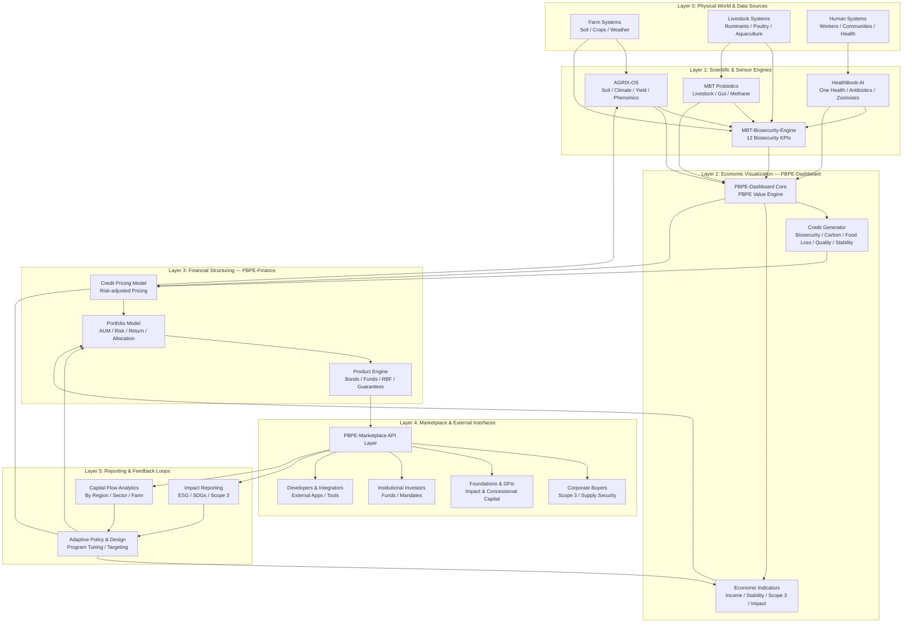

```mermaid
flowchart TD

    %% ========== LAYER 0: PHYSICAL & DATA SOURCES ==========
    subgraph L0[Layer 0: Physical World & Data Sources]
        P1[Farm Systems<br>Soil / Crops / Weather]
        P2[Livestock Systems<br>Ruminants / Poultry / Aquaculture]
        P3[Human Systems<br>Workers / Communities / Health]
    end

    %% ========== LAYER 1: SCIENTIFIC & SENSOR ENGINES ==========
    subgraph L1[Layer 1: Scientific & Sensor Engines]
        A1[AGRIX-OS<br>Soil / Climate / Yield / Phenomics]
        A2[MBT-Biosecurity-Engine<br>12 Biosecurity KPIs]
        A3[HealthBook-AI<br>One Health / Antibiotics / Zoonoses]
        A4[MBT Probiotics<br>Livestock / Gut / Methane]
    end

    %% ========== LAYER 2: ECONOMIC VISUALIZATION ==========
    subgraph L2[Layer 2: Economic Visualization — PBPE-Dashboard]
        B1[PBPE-Dashboard Core<br>PBPE Value Engine]
        B2[Credit Generator<br>Biosecurity / Carbon / Food Loss / Quality / Stability]
        B3[Economic Indicators<br>Income / Stability / Scope 3 / Impact]
    end

    %% ========== LAYER 3: FINANCIAL STRUCTURING ==========
    subgraph L3[Layer 3: Financial Structuring — PBPE-Finance]
        C1[Credit Pricing Model<br>Risk-adjusted Pricing]
        C2[Portfolio Model<br>AUM / Risk / Return / Allocation]
        C3[Product Engine<br>Bonds / Funds / RBF / Guarantees]
    end

    %% ========== LAYER 4: MARKETPLACE & EXTERNAL ==========
    subgraph L4[Layer 4: Marketplace & External Interfaces]
        D1[PBPE-Marketplace API Layer]
        D2[Corporate Buyers<br>Scope 3 / Supply Security]
        D3[Foundations & DFIs<br>Impact & Concessional Capital]
        D4[Institutional Investors<br>Funds / Mandates]
        D5[Developers & Integrators<br>External Apps / Tools]
    end

    %% ========== LAYER 5: REPORTING & FEEDBACK ==========
    subgraph L5[Layer 5: Reporting & Feedback Loops]
        E1[Impact Reporting<br>ESG / SDGs / Scope 3]
        E2[Capital Flow Analytics<br>By Region / Sector / Farm]
        E3[Adaptive Policy & Design<br>Program Tuning / Targeting]
    end

    %% ========== PHYSICAL → SCIENTIFIC ==========
    P1 --> A1
    P1 --> A2
    P2 --> A2
    P2 --> A4
    P3 --> A3

    %% ========== SCIENTIFIC INTERNAL FLOWS ==========
    A1 --> A2
    A3 --> A2
    A4 --> A2

    %% ========== SCIENTIFIC → ECONOMIC (DASHBOARD) ==========
    A1 --> B1
    A2 --> B1
    A3 --> B1
    A4 --> B1

    B1 --> B2
    B1 --> B3

    %% ========== ECONOMIC → FINANCIAL (FINANCE) ==========
    B2 --> C1
    B1 --> C1
    B3 --> C2

    C1 --> C2
    C2 --> C3

    %% ========== FINANCIAL → MARKETPLACE ==========
    C3 --> D1

    D1 --> D2
    D1 --> D3
    D1 --> D4
    D1 --> D5

    %% ========== MARKETPLACE → REPORTING ==========
    D1 --> E1
    D1 --> E2

    E1 --> E3
    E2 --> E3

    %% ========== FEEDBACK LOOPS ==========
    E3 --> C2
    E3 --> B3
    E3 --> A1
```
